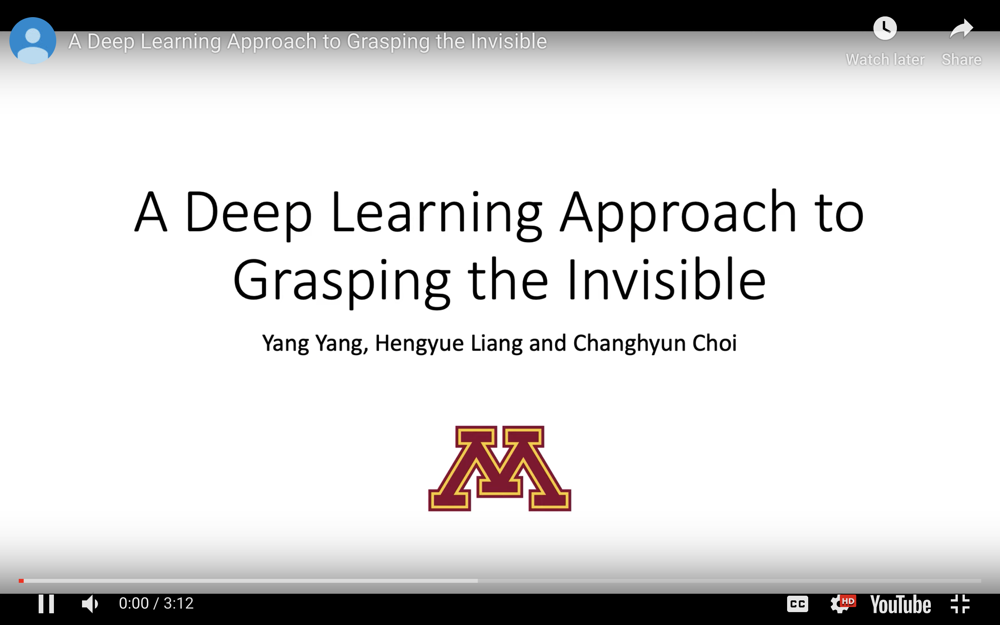
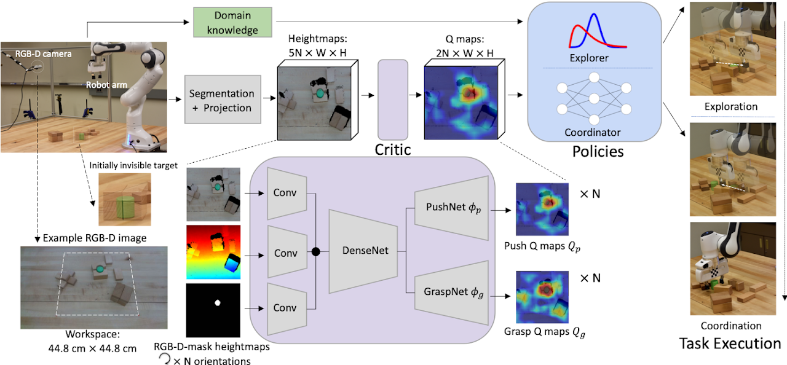

# A Deep Learning Approach to Grasping the Invisible

This repository is for the paper

**[A Deep Learning Approach to Grasping the Invisible][1]**<br/>
*Yang, Yang and Liang, Hengyue and Choi, Changhyun*<br/>
[arxiv.org/abs/1909.04840][2]<br/>

<p align="center">
    <a href="https://youtu.be/_jssCcP_oKg">  </a>
    <i>Introductory Video (with audio)</i> 
</p>

We study an emerging problem named "grasping the invisible" in robotic manipulation, 
in which a robot is tasked to grasp an initially invisible target object via a sequence of pushing and grasping actions. 
In this problem, pushes are needed to search for the target and rearrange cluttered objects around it to enable effective grasps. 
We propose to solve the problem by formulating a deep learning approach in a critic-policy format. The target-oriented motion critic, 
which maps both visual observations and target information to the expected future rewards of pushing and grasping motion primitives, 
is learned via deep Q-learning. We divide the problem into two subtasks, and two policies are proposed to tackle each of them, 
by combining the critic predictions and relevant domain knowledge. 
A Bayesian-based policy accounting for past action experience performs pushing to search for the target; 
once the target is found, a classifier-based policy coordinates target-oriented pushing and grasping to grasp the target in clutter. 
The motion critic and the classifier are trained in a self-supervised manner through robot-environment interactions. 
Our system achieves a 93% and 87% task success rate on each of the two subtasks in simulation and an 85% task success rate in real robot experiments on the whole problem, 
which outperforms several baselines by large margins.

<p align="center">
    
    <i>System Overview</i>  
</p>

If you find this code useful, please consider citing our work:

```
@article{yang2020deep,
title={A Deep Learning Approach to Grasping the Invisible},
author={Yang, Yang and Liang, Hengyue and Choi, Changhyun},
journal={IEEE Robotics and Automation Letters},
volume={5},
number={2},
pages={2232--2239},
year={2020},
doi={10.1109/LRA.2020.2970622},
publisher={IEEE}
}
```

## Dependencies
```
- Ubuntu 16.04
- Python 3
- PyTorch 0.4
```
The file of the conda environment is environment.yml. We use [V-REP 3.5.0][5] as the simulation environment.

## Code
We do experiments on a NVIDIA 1080 Ti GPU. It requires at least 8GB of GPU memory to run the code.

First run V-REP and open the file ```simulation/simulation.ttt``` to start the simulation. Then download the pre-trained models by running

```
sh downloads.sh
```

### Training
To train from scratch, run

```
python main.py
```

You can also resume training from checkpoint and collected data
```
python main.py
--load_ckpt --critic_ckpt CRITIC-MODEL-PATH --coordinator_ckpt COORDINATOR-MODEL-PATH
--continue_logging --logging_directory SESSION-DIRECTORY
```

### Testing
```
python main.py
--is_testing --test_preset_cases --test_target_seeking
--load_ckpt --critic_ckpt CRITIC-MODEL-PATH --coordinator_ckpt COORDINATOR-MODEL-PATH
--config_file TEST-CASE-PATH
```
The files of the test cases are available in ```simulation/preset```.

## Acknowledgments
We use the following code in our project

- [Visual Pushing and Grasping Toolbox][3]

- [Light-Weight RefineNet for Real-Time Semantic Segmentation][4]

[1]: https://sites.google.com/umn.edu/grasping-invisible
[2]: https://arxiv.org/abs/1909.04840
[3]: https://github.com/andyzeng/visual-pushing-grasping
[4]: https://github.com/DrSleep/light-weight-refinenet
[5]: http://coppeliarobotics.com/previousVersions
